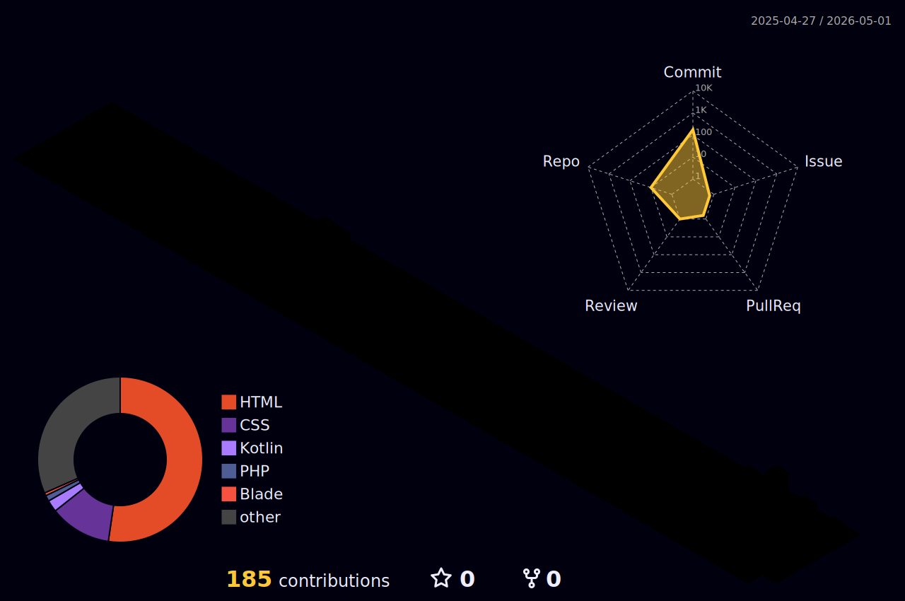

<!-- Header Banner -->

  

  

 

  **i write code**&nbsp;&nbsp;&nbsp;&nbsp;**and build tech**&nbsp;&nbsp;

 

  

    
    
  

 

##  Tech Stack & Tools

  
    
  
    
  

 

  
  

   
  

 

  <!-- This image is generated by the GitHub Action -->
  

 

<!-- Footer -->

  

