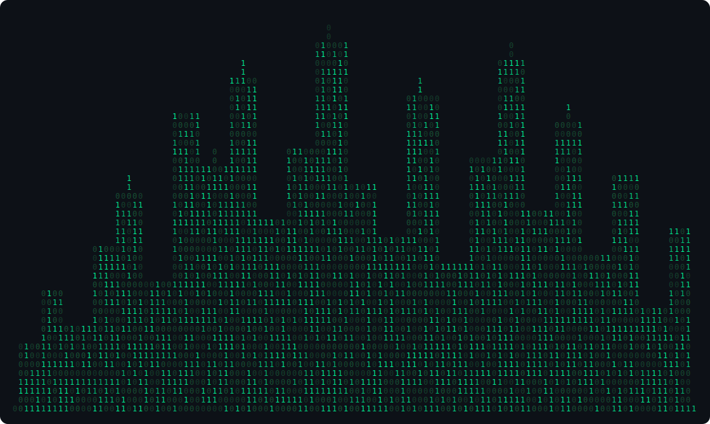

<!-- Header Banner: Neural Network GIF -->

  

  

 

  i love code&nbsp;&nbsp;&nbsp;&nbsp;and build&nbsp;&nbsp;

 

  

    
    
  

 

 

## Tech Stacks

  
    
  
    
  

 

<!-- GitHub Stats & Top Languages -->

  
  

<!-- GitHub Streak (URL updated: herokuapp → demolab) -->

   
  

 

<!-- 3D Contribution Graph: generated by profile-3d.yml GitHub Action -->

  

 

<!-- Snake Animation: generated by snake.yml → pushed to branch 'output' -->

  <picture>
    <source media="(prefers-color-scheme: dark)" srcset="https://raw.githubusercontent.com/ieatcheese99/ieatcheese99/output/github-contribution-grid-snake-dark.svg">
    <source media="(prefers-color-scheme: light)" srcset="https://raw.githubusercontent.com/ieatcheese99/ieatcheese99/output/github-contribution-grid-snake.svg">
    
  </picture>

 

<!-- Binary City: static SVG in repo root -->

  

 

<!-- Footer -->

  

