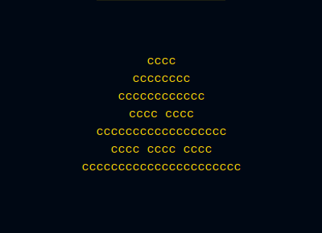

<!-- ▓▓▓▓▓▓▓▓▓▓▓▓▓▓▓▓▓▓▓▓▓▓▓  PRTS TERMINAL HEADER  ▓▓▓▓▓▓▓▓▓▓▓▓▓▓▓▓▓▓▓▓▓▓▓ -->

  

<!-- ▓▓▓▓▓▓▓▓▓▓▓▓▓▓▓▓▓▓▓▓▓▓▓  BOOT SEQUENCE  ▓▓▓▓▓▓▓▓▓▓▓▓▓▓▓▓▓▓▓▓▓▓▓ -->

  

 

<!-- ▓▓▓▓▓▓▓▓▓▓▓▓▓▓▓▓▓▓▓▓▓▓▓  CONTACT LINKS  ▓▓▓▓▓▓▓▓▓▓▓▓▓▓▓▓▓▓▓▓▓▓▓ -->

  
  &nbsp;
  

 

---

<!-- ╔══════════════════════════════════════════════════════════════╗ -->
<!-- ║                     OPERATOR FILE                           ║ -->
<!-- ╚══════════════════════════════════════════════════════════════╝ -->

  

 

<table>
<tr>
<td align="center" width="46%">

<code>// SINGULARITY CLASS-C | GRAVITATIONAL LENSING: ACTIVE</code>

</td>
<td valign="top" width="54%">

<pre>
╔══════════════════════════════════╗
║   OPERATOR PROFILE               ║
╠══════════════════════════════════╣
║                                  ║
║   ID     : ieatcheese99          ║
║   ROLE   : Junior Fullstack Dev  ║
║   STATUS : ACTIVE                ║
║                                  ║
╠══════════════════════════════════╣
║                                  ║
║  🔭 Fokus: Web Development       ║
║     (Laravel, React, Next.js)    ║
║                                  ║
║  🌱 Lagi dalami:                 ║
║     System Design &amp;              ║
║     UI/UX konsisten              ║
║                                  ║
╚══════════════════════════════════╝
</pre>

</td>
</tr>
</table>

 

---

<!-- ╔══════════════════════════════════════════════════════════════╗ -->
<!-- ║                    TECH ARSENAL                             ║ -->
<!-- ╚══════════════════════════════════════════════════════════════╝ -->

  

 

  

 

---

<!-- ╔══════════════════════════════════════════════════════════════╗ -->
<!-- ║                   COMBAT RECORD                             ║ -->
<!-- ╚══════════════════════════════════════════════════════════════╝ -->

  

 

  
  

  

 

---

<!-- ╔══════════════════════════════════════════════════════════════╗ -->
<!-- ║                   ACTIVITY TRACE                            ║ -->
<!-- ╚══════════════════════════════════════════════════════════════╝ -->

  

 

  <picture>
    <source media="(prefers-color-scheme: dark)" srcset="https://raw.githubusercontent.com/ieatcheese99/ieatcheese99/output/github-contribution-grid-snake-dark.svg">
    <source media="(prefers-color-scheme: light)" srcset="https://raw.githubusercontent.com/ieatcheese99/ieatcheese99/output/github-contribution-grid-snake.svg">
    
  </picture>

 

---

<!-- ╔══════════════════════════════════════════════════════════════╗ -->
<!-- ║              ANOMALY DETECTED — CHEESE                      ║ -->
<!-- ╚══════════════════════════════════════════════════════════════╝ -->

  

 

  

  <code>[ ANOMALY: LACTO-ORGANIC SIGNATURE DETECTED | DAIRY ARTIFACT CLASS-C ]</code>

 

---

<!-- ▓▓▓▓▓▓▓▓▓▓▓▓▓▓▓▓▓▓▓▓▓▓▓  FOOTER  ▓▓▓▓▓▓▓▓▓▓▓▓▓▓▓▓▓▓▓▓▓▓▓ -->

  

